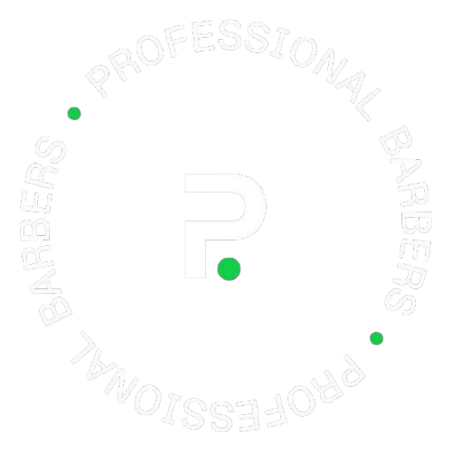

<div align="center">



# Pro Barber

### Professional Barbershop Website & Management System

A modern, professional barbershop digital platform combining a customer-facing public website with a powerful barbershop management system.


\

**Public Website:** [Visit the Pro Barber Website](#)

</div>

---

## 📖 About the Project

**Pro Barber** is a modern digital platform designed to help barbershops establish a strong online presence while managing their day-to-day operations efficiently.

The project combines two core components:

1. **Public Barbershop Website** — A professional customer-facing website showcasing the barbershop, services, gallery, team, location, and contact information.
2. **Barbershop Management System** — A dedicated management platform designed to streamline barbershop operations, customer management, appointments, services, and business administration.

The goal is to create a seamless digital experience for both **barbershop customers and staff**, bringing the public website and internal management functionality together into one unified ecosystem.

---

## 🌐 Public Website

The public website provides customers with an easy and professional way to discover the barbershop and interact with its services.

### Key Features

* 🏠 Professional homepage
* 💈 Barbershop services showcase
* 👨‍💼 Barber and team profiles
* 🖼️ High-quality image gallery
* 📍 Location and Google Maps integration
* 📞 Contact information
* 📅 Appointment and booking functionality
* ⭐ Professional customer experience
* 📱 Fully responsive design
* 🖥️ Desktop, tablet, and mobile support
* 🔗 Integrated navigation across all pages
* 🧭 Consistent header and footer components

### Public Website

**Live Website:**
`https://pro-barber.horsemetech.com`

> Replace the URL above with the live Pro Barber website address.

---

## 💈 Barbershop Management System

The **Barbershop System** is the operational component of the Pro Barber platform.

It is designed to help barbershop owners and staff manage business operations from a centralized platform.

### Core Capabilities

* 👥 Customer management
* 💈 Barber management
* 📅 Appointment management
* ✂️ Service management
* 🏪 Barbershop management
* 📊 Business dashboard
* 🗓️ Booking administration
* 🖼️ Media and gallery management
* 📍 Location management
* ⚙️ System configuration
* 🔐 User authentication and access control
* 📱 Responsive administration interface

The system is designed with scalability in mind, allowing additional functionality to be introduced as the business grows.

---

## 🏗️ Project Structure

The repository is organized around the public website and the barbershop management system.

```text
pro-barber/
│
├── barbershop-system/
│   ├── assets/
│   │   └── images/
│   │       └── default-avatar.png
│   │
│   └── ...
│
├── ...
│
└── README.md
```

### Main Components

| Component                          | Description                        |
| ---------------------------------- | ---------------------------------- |
| `barbershop-system/`               | Core barbershop management system  |
| `barbershop-system/assets/`        | System assets and static resources |
| `barbershop-system/assets/images/` | Images used throughout the system  |
| `default-avatar.png`               | Default branding/avatar image      |
| `README.md`                        | Project documentation              |

---

## 🎯 Project Objectives

The Pro Barber project aims to:

* Establish a professional digital presence for the barbershop
* Improve customer engagement
* Make services easier to discover
* Simplify appointment and booking workflows
* Centralize barbershop operations
* Improve customer management
* Provide staff with an efficient management platform
* Create a scalable foundation for future business automation
* Deliver a consistent brand experience across public and internal platforms

---

## ✨ Platform Vision

The long-term vision for Pro Barber is to provide a complete digital ecosystem for modern barbershops.

Potential future capabilities include:

* 📅 Advanced online booking
* 💳 Online payments
* 🔔 Automated appointment notifications
* 📧 Email notifications
* 📱 SMS notifications
* 📈 Business analytics
* 💰 Revenue reporting
* 👥 Customer loyalty programs
* 🎁 Promotions and discount management
* ⭐ Customer reviews
* 📊 Barber performance analytics
* 🧾 Invoicing and payments
* 📦 Product and inventory management
* 🔗 Third-party integrations
* 🤖 Business automation

---

## 🔐 Security

Security is an important part of the Pro Barber platform.

The system is designed with security considerations including:

* Secure authentication
* Role-based access control
* Protected administrative functionality
* Secure handling of customer information
* Input validation and sanitization
* Secure session management
* Regular software updates
* Secure production deployment practices

> Production deployments should always use HTTPS and follow appropriate security best practices.

---

## 📱 Responsive Design

The Pro Barber platform is designed to provide a consistent experience across:

* 💻 Desktop computers
* 💻 Laptops
* 📱 Smartphones
* 📲 Tablets

The public website prioritizes a mobile-friendly customer experience, while the management system is designed to remain practical and accessible for staff using different screen sizes.

---

## 🚀 Getting Started

### Prerequisites

Before installing or running the project, ensure that your environment meets the requirements defined by the application.

Typical requirements may include:

* Web server
* Database server
* PHP / Node.js runtime, depending on the application component
* Required PHP or Node.js dependencies
* Modern web browser
* SSL certificate for production environments

### Installation

Clone the repository:

```bash
git clone git@github.com:sya-one/pro-barber.git
```

Navigate into the project:

```bash
cd pro-barber
```

Follow the installation and configuration instructions for the specific application components.

> Detailed deployment documentation will be added as the project architecture and production deployment process are finalized.

---

## 🛠️ Development

Development should be performed in a controlled environment before changes are deployed to production.

Recommended workflow:

```text
Development
    │
    ▼
Testing
    │
    ▼
Code Review
    │
    ▼
Staging
    │
    ▼
Production
```

### Git Workflow

Create a feature branch:

```bash
git checkout -b feature/your-feature-name
```

Make your changes and commit:

```bash
git add .
git commit -m "Add your feature description"
```

Push the branch:

```bash
git push origin feature/your-feature-name
```

Create a Pull Request for review before merging changes into the main branch.

---

## 📸 Branding & Assets

Project branding assets are maintained within the project structure.

The default system image is located at:

```text
barbershop-system/assets/images/default-avatar.png
```

This asset can be used as the default visual identity for the Barbershop System where appropriate.

Additional branding assets should be organized within the project's assets directory to maintain a clean and consistent structure.

---

## 🗺️ Roadmap

### Phase 1 — Foundation

* [x] Public website
* [x] Barbershop branding
* [x] Responsive website structure
* [x] Barbershop system foundation
* [x] GitHub repository
* [x] Production deployment documentation

### Phase 2 — Business Operations

* [ ] Customer management
* [ ] Barber management
* [ ] Service management
* [ ] Appointment management
* [ ] Booking workflow
* [ ] Dashboard improvements

### Phase 3 — Automation

* [ ] Email notifications
* [ ] SMS notifications
* [ ] Automated booking confirmations
* [ ] Customer reminders
* [ ] Business workflow automation

### Phase 4 — Business Intelligence

* [ ] Revenue analytics
* [ ] Customer analytics
* [ ] Barber performance reporting
* [ ] Business reports
* [ ] Advanced dashboards

---

## 🤝 Contributing

Contributions, improvements, and feature suggestions are welcome.

For significant changes:

1. Create a feature branch.
2. Make your changes.
3. Test the changes thoroughly.
4. Commit your work with a clear commit message.
5. Push your branch.
6. Open a Pull Request.

Please ensure that all contributions maintain the project's quality, security, performance, and coding standards.

---

## 📄 License

This project is proprietary software.

All rights reserved.

The source code, branding, design, assets, and intellectual property contained within this repository may not be copied, redistributed, modified, or commercially reused without explicit permission from the project owner.

---

## 👨‍💻 Project

**Pro Barber**

Professional Barbershop Website & Management System

**Repository:**
`https://github.com/sya-one/pro-barber`

**Public Website:**
`https://pro-barber.horsemetech.com`

---

<div align="center">

### Built with passion for modern barbershop businesses. 💈✂️

**Pro Barber**

</div>
